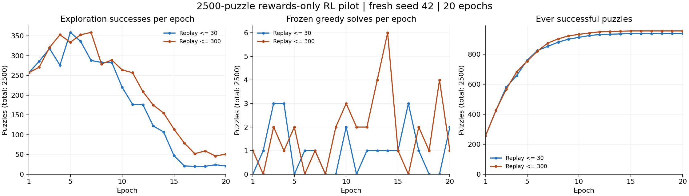
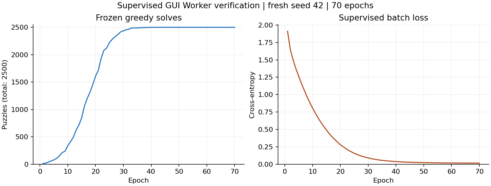

# 2500문제의 정답 없는 강화학습: 첫 전체 실험

## 성공 판정

목표는 하나의 신경망이 **2500개 원래 시작 보드 모두에서**, 정답 경로·탐색기·학습 중 가중치 변경 없이 합법 행동 점수의 argmax만으로 해결하는 것입니다. greedy 평가는 상태 반복 또는 최대 300행동에서 종료합니다. 저장한 최종 모델을 다시 불러와 같은 결과가 나와야 합니다.

전체 2500개를 학습에 사용하므로 이 목표의 달성 여부와 미학습 구성에 대한 일반화는 별개입니다. 이번 실험은 일반화 시험이 아닙니다.

## 실험 설계

같은 seed 42의 무작위 초기 가중치로 두 조건을 시작했습니다. 신경망은 224 → 512 → 512 → [Policy 140 | Value 1], parameter 450,189개입니다.

| 조건 | 매 epoch 새 시행 | 성공 경험의 최대 복습 수 | 학습 epoch |
|---|---:|---:|---:|
| 기존 설정 | 2500문제 각 1회 | 30경로 | 20 |
| 복습량 증가 | 2500문제 각 1회 | 300경로 | 20 |

각 조건은 총 50,000회의 새 학습 episode를 수행하고, 매 epoch 고정 모델로 2500문제를 평가합니다. 복습량 외의 설정은 같습니다. 다만 복습에서 소비하는 난수가 달라 이후 탐험 궤적도 달라지므로, 한 seed 결과를 통계적으로 확정된 우열로 해석해서는 안 됩니다.

- 초기 가중치: 무작위. 교사 모델/지도학습 초기화 없음.
- 데이터: 초기 차량 배치만 학습에 전달. 앱 minimum은 학습 객체에서 제거.
- 방법: ε-greedy clipped V-trace와 자기 성공 경험의 positive-advantage replay.
- ε: 20 epoch 중 앞 16 epoch에서 1.00 → 0.05, 이후 0.05 유지.
- γ=0.99/행동, n-step=16, 최대 300행동.
- 이동 −0.01/칸, 반복 −0.03, 해결 +1과 자동 탈출 비용.
- replay는 최대 2500문제의 자기 성공 경로를 보관. 외부 정답·교사 경로 사용 없음.
- 차량 순서 증강 없음. minimum 기반 curriculum 없음.
- 최고 checkpoint는 학습 해결 수, 동률이면 실제 greedy 보상으로 선택.

이 20 epoch 실험은 단기 비교입니다. GUI 기본값인 1000 epoch의 ε 일정과 다르며, 장기 수렴이나 이 알고리즘의 성능 상한을 판단하는 실험이 아닙니다.

## 결과

원시 로그는 `experiments/rl2500-replay30/` 및 `experiments/rl2500-replay300/`에, 재로드 검증은 `verification/research2500.json`에 있습니다.

| 조건 | 최종 greedy | 20 epoch 중 최고 greedy | 마지막 탐험 성공 | 한 번 이상 성공한 문제 |
|---|---:|---:|---:|---:|
| 복습 최대 30경로 | 2/2500 | 3/2500 | 21/2500 | 939/2500 |
| 복습 최대 300경로 | 1/2500 | 6/2500 | 51/2500 | 956/2500 |

두 조건 모두 최종 checkpoint를 다시 불러와 원시 로그의 상태와 이동 수가 일치함을 확인했습니다. **이번 강화학습 실험은 2500/2500 목표를 달성하지 못했습니다.** 단기·단일 seed 비교로, 복습량 증가가 충분한 해법이라고 결론 내릴 수 없습니다.

왼쪽은 탐험 중 성공 수, 가운데는 각 epoch 뒤 고정 greedy 해결 수, 오른쪽은 지금까지 한 번이라도 성공해 replay에 보관된 문제 수입니다. 세 값은 서로 다른 지표입니다.

| 조건 | Easy | Medium | Hard | Expert |
|---|---:|---:|---:|---:|
| 복습 30 | 2/625 | 0/625 | 0/625 | 0/625 |
| 복습 300 | 1/625 | 0/625 | 0/625 | 0/625 |

모드별 표는 최종 greedy 결과입니다. 두 조건의 미해결 문제는 모두 반복 상태(loop)로 종료했습니다. 두 실행은 동시에 수행했으므로 측정 시간은 전용 CPU 성능 비교에 사용하지 않습니다. 각 실행 소요 시간은 복습 30: 31.2분, 복습 300: 31.5분입니다.

## 자기 성공 경로의 품질 진단

별도의 **균등 무작위 탐험 1회**에서 2500개 중 257개를 해결했습니다. 네트워크 학습과 교사 데이터 없이 수행한 진단입니다. 성공은 Easy 211, Medium 36, Hard 9, Expert 1개였습니다.

그 257개 경로에서 이미 방문한 동일 상태 사이의 순환 구간만 제거하고, 남은 모든 행동의 합법성과 최종 해결을 다시 검사했습니다. 최단 경로 탐색이나 앱 minimum은 사용하지 않았습니다.

| 성공 경로 평균 | 원래 탐험 경로 | 관찰된 반복 구간 제거 후 |
|---|---:|---:|
| 행동 수 | 177.67 | 69.59 |
| 이동 칸 수·탈출 비용 포함 | 257.36 | 104.39 |
| 누적 보상 | −2.8114 | −0.04393 |
| 양의 누적 보상을 가진 경로 수 | 14/257 | 133/257 |

이는 성공해도 비효율적인 경로가 다수 발견된다는 직접적인 관찰입니다. **반복 제거 경로로 신경망을 학습한 결과는 아닙니다.** 두 20 epoch RL 비교 조건에는 이 처리를 적용하지 않았습니다. 진단 기록은 `verification/random-exploration.json`, 재현 코드는 `tools/analyze_random_exploration.py`입니다.

## 지도학습 탭의 재현 확인

새 GUI에서 사용하는 Worker로 지도학습도 무작위 초기화부터 실행했습니다. 학습 상태 48,640개, batch 512, seed 42, 70 epoch입니다. 42 epoch에 처음 2500/2500에 도달했고, 70 epoch 최종 모델도 **2500/2500, Efficiency 1.000**이었습니다. 최종 모델을 다시 불러와 2500개 모두 앱 minimum과 같은 이동 수로 해결함을 확인했습니다.

이 결과는 지도학습 탭의 동작 검증입니다. 강화학습의 성공 사례로 합산하지 않습니다. `verification/supervised2500.json`과 `experiments/supervised2500/`에 기록했습니다.

## 연구 해석과 다음 실험

현재의 자기 성공 경험 복습은 에이전트 자신의 좋은 시행을 재사용하는 방식입니다. 이 방향의 근거는 [Oh et al., Self-Imitation Learning, ICML 2018](https://proceedings.mlr.press/v80/oh18b.html)입니다. 본 코드는 그 원칙을 사용하는 보조 학습을 구현했으며, 논문의 모든 설정을 그대로 복제한 것은 아닙니다.

이번 비교에서 특히 구분할 것은 **한 번이라도 성공 경로를 발견한 문제 수**와 **최종 신경망이 greedy로 푸는 문제 수**입니다. 전자는 탐험 경험의 범위, 후자는 학습 결과의 활용 능력을 나타냅니다. 둘 사이 차이가 크면 탐험을 계속 늘리는 것뿐 아니라 발견한 경험을 유지하고 학습하는 방식을 점검해야 합니다. 이것만으로 원인을 하나로 확정할 수는 없습니다.

가장 먼저 시험할 후보는 **자기 성공 경로에서 관찰된 순환 구간을 제거한 뒤 복습하는 것**입니다. 보상 개선은 확인했지만 신경망 성능 개선은 아직 확인하지 않았으므로, 같은 seed·시행 예산에서 기존 replay와 비교해야 합니다.

그 이후 후보는 스스로 방문한 상태를 보관하고 그 상태로 돌아가 탐험을 이어가는 방식입니다. 알려진 상태까지 매번 무작위로 다시 도달해야 하는 부담을 줄이는 접근은 [Ecoffet et al., First return, then explore, Nature 2021](https://www.nature.com/articles/s41586-020-03157-9)의 Go-Explore 원칙을 참고할 수 있습니다. Rush Hour에서 효과가 있다는 것은 아직 가설이며 이번 버전에는 적용하지 않았습니다.

이 후보를 실험하더라도 외부 교사 경로를 주입하지 않고, 실제로 방문한 상태만 보관하며, 최종 평가는 원래 시작 보드에서 순수 신경망 greedy로 수행해야 합니다. 탐험 과정에서 경로를 발견하는 것과 신경망 자체가 모든 문제를 해결하는 것을 계속 분리해서 보고하겠습니다.

## GUI 및 데이터 분리 검증

- 단위 테스트 30개 통과.
- 실제 Window/QThread에서 지도학습과 강화학습을 각각 3 epoch 실행하고, 도중에 탭을 바꾸며 모델/그래프 분리를 확인.
- 강화학습 실행 중 교사 경로 파일 접근을 차단한 상태로 동작 확인.
- 가짜 minimum/정답 메타데이터를 주어도 RL 가중치와 best 선택이 동일함을 확인.
- 평가 중 가중치와 optimizer가 변하지 않음을 확인.
- 시각화 콜백을 켜고 꺼도 RL 행동 경로·가중치·Adam 상태가 정확히 같음을 확인.
- 전체 2500개 GUI 연결은 별도의 1 epoch·1행동 검사로 확인. 이 연결 검사를 수렴 성적으로 계산하지 않음.

검증 기록은 `verification/`에 있습니다. 실험은 Linux CPU, Python/NumPy/PySide6 환경에서 수행했습니다. 운영체제와 BLAS 차이에 따라 학습 궤적이 달라질 수 있습니다.
